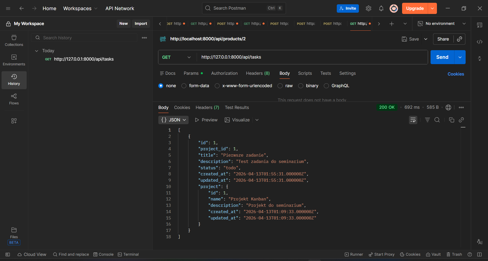
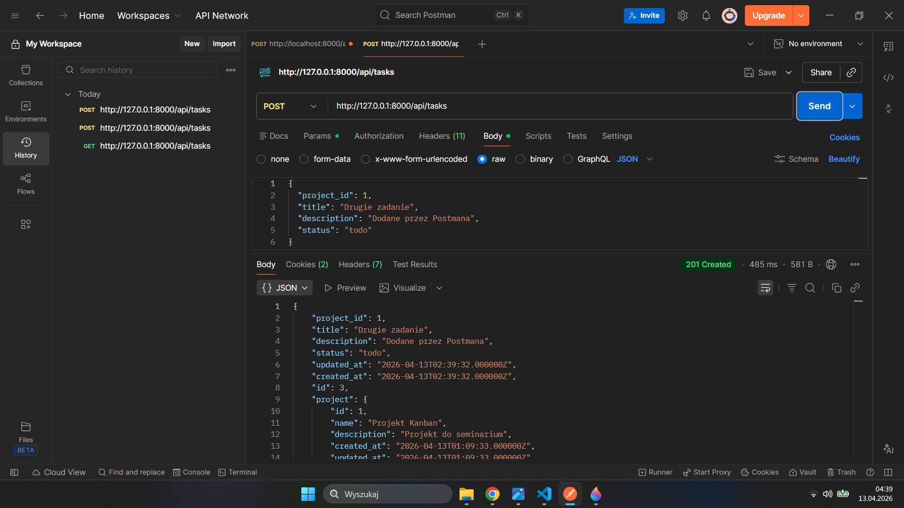
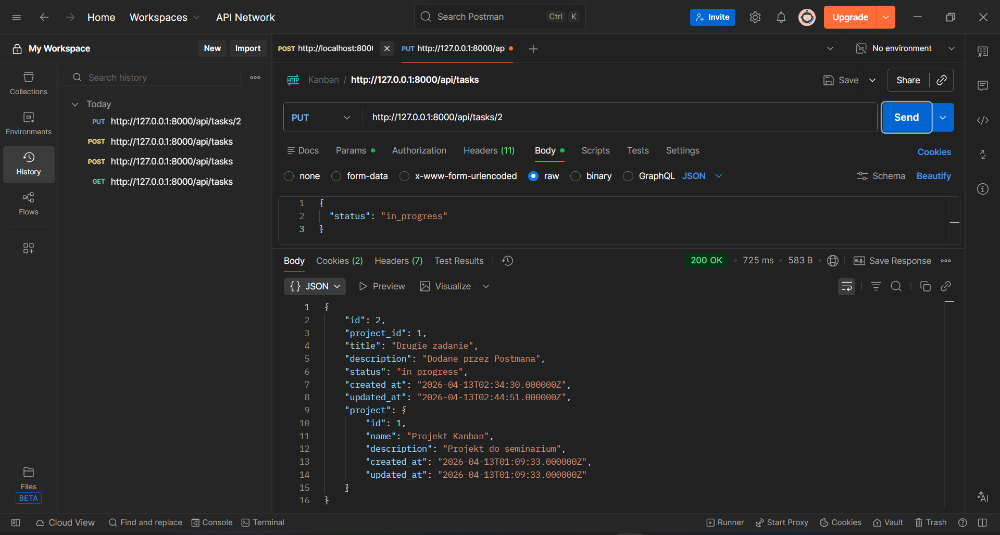
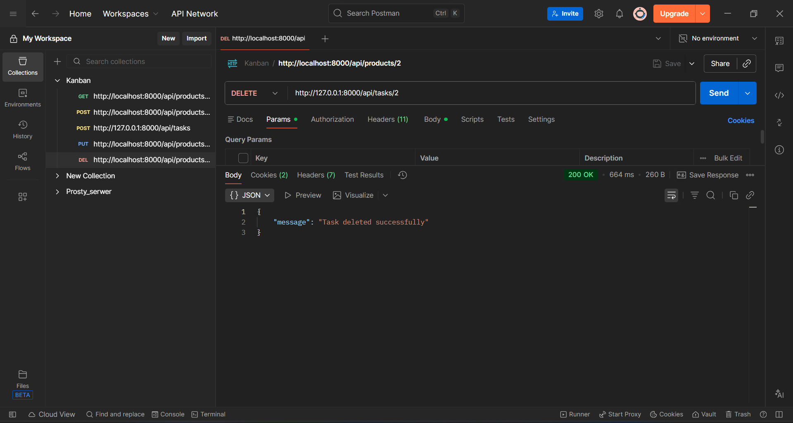

# Kanban Project

A web application for managing projects and tasks in Kanban style, created as part of an engineering seminar project.

## Project overview

The application supports task management in a Kanban workflow and is being developed in stages according to the MVP / MLP / GA model.

Current backend implementation includes a REST API built in Laravel, PostgreSQL database integration, task and project models, and tested CRUD operations for tasks.

## Main goals

- manage projects and tasks
- support Kanban workflow: To Do / In Progress / Done
- build a clear architecture based on frontend + backend + database
- prepare a solid MVP for seminar presentation
- extend the application later with additional features such as comments, filtering, notifications, and history of changes

## Tech stack

### Backend
- Laravel
- PHP
- REST API

### Database
- PostgreSQL

### Frontend
- React *(planned / in progress)*

### Authentication
- Auth0 *(planned / in progress)*

### Testing
- Postman

## Current status

### Implemented
- PostgreSQL configuration
- database migrations
- `projects` table
- `tasks` table
- relation: task belongs to project
- Laravel models: `Project`, `Task`
- `TaskController`
- API routes for tasks
- tested CRUD for tasks using Postman

### Tested endpoints
- `GET /api/tasks`
- `POST /api/tasks`
- `PUT /api/tasks/{id}`
- `DELETE /api/tasks/{id}`

## Example API response

```json
[
  {
    "id": 1,
    "project_id": 1,
    "title": "Pierwsze zadanie",
    "description": "Test zadania do seminarium",
    "status": "todo",
    "project": {
      "id": 1,
      "name": "Projekt Kanban",
      "description": "Projekt do seminarium"
    }
  }
]
```
## Architecture

### The application is based on a simple three-layer architecture:

- Frontend – React user interface
- Backend – Laravel REST API
- Database – PostgreSQL

## Data flow:

- User performs action in frontend
- frontend sends request to Laravel API
- Laravel processes logic and communicates with PostgreSQL
- API returns JSON response to frontend

## Planned features
#### MVP
- adding tasks
- task status management
- PostgreSQL data persistence
- roles: admin / user
- Kanban board
- user authentication with Auth0
#### MLP
- comments on tasks
- filtering tasks
- responsive interface
- drag & drop in Kanban
- assigning tasks to users
#### GA
- task history / logs
- notifications
- data export
- deployment

## Project structure
```
backend/
├── app/
│   ├── Http/Controllers/
│   │   └── TaskController.php
│   └── Models/
│       ├── Project.php
│       └── Task.php
├── database/
│   └── migrations/
├── routes/
│   └── api.php
```
## How to run backend locally

#### 1. Clone repository
```
git clone <REPOSITORY_URL>
cd kanban-project
```
#### 2. Go to backend
```
cd backend
```
#### 3. Install dependencies
```
composer install
```
#### 4. Configure environment

### Create .env file and set PostgreSQL connection:
```
DB_CONNECTION=pgsql
DB_HOST=127.0.0.1
DB_PORT=5432
DB_DATABASE=kanban_db
DB_USERNAME=postgres
DB_PASSWORD=your_password
```
#### 5. Run migrations
```
php artisan migrate
```
#### 6. Start server
```
php artisan serve
```
### API testing

- The backend was tested manually in **Postman** using **CRUD requests** for the tasks resource.

## Recommended test order:
- `GET /api/tasks`
- `POST /api/tasks`
- `PUT /api/tasks/{id}`
- `DELETE /api/tasks/{id}`

### Author / Team

Engineering seminar project developed as a team project.

### Notes

This repository currently focuses on the backend foundation of the system. Frontend and authentication modules are planned as next stages of development.

## Architecture diagram

```mermaid
flowchart LR
    U[User] --> F[React Frontend]
    F -->|HTTP / JSON| B[Laravel REST API]
    B -->|Eloquent / SQL| D[(PostgreSQL Database)]

    B --> C[TaskController]
    C --> T[Task Model]
    C --> P[Project Model]

    T --> D
    P --> D
  ```
## Architecture diagram description

The system uses a classic client-server architecture:

- the **user** interacts with the application through the frontend
- the **React frontend** sends HTTP requests to the backend
- the **Laravel backend** handles business logic and returns JSON responses
- the **PostgreSQL database** stores persistent data such as projects and tasks    

## Screenshots

### GET /api/tasks


### POST /api/tasks


### PUT /api/tasks


### DELETE /api/tasks
